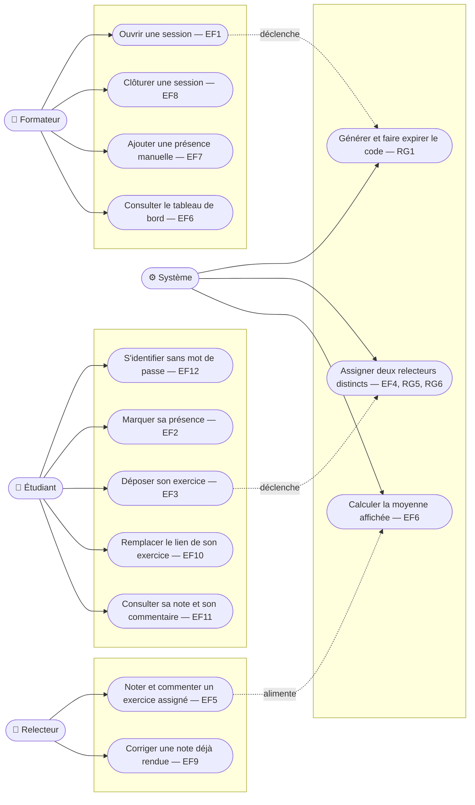

# D1 — Cas d'utilisation

Mermaid n'a pas de type de diagramme « cas d'utilisation » natif ; on le représente ici
avec un `flowchart`, acteurs à gauche, cas d'utilisation en forme de stade (arrondis)
regroupés par acteur.

> **Note** : le Relecteur est un rôle temporaire porté par un Étudiant présent à la
> session (voir `docs/CAHIER_DES_CHARGES.md` §2). Il n'y a pas de compte « relecteur »
> séparé.
