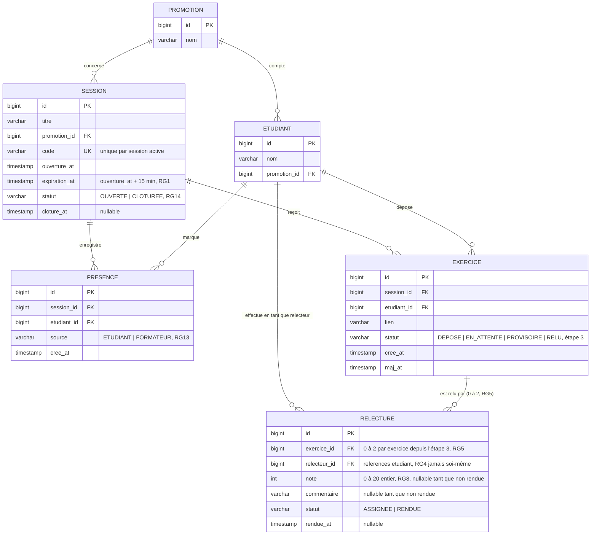

# D2 — Modèle de données

Ce diagramme doit correspondre exactement aux migrations Flyway/Liquibase du backend
(`/backend/.../db/migration`). Toute divergence entre les deux sera une faute en
Phase 2.

> **Mis à jour à l'étape 3** : l'enveloppe remplace le relecteur unique (Q6) par deux
> relecteurs distincts par exercice. `EXERCICE ||--o| RELECTURE` (0 ou 1) devient
> `EXERCICE ||--o{ RELECTURE` (0 à 2, borne haute imposée par l'application, pas par
> la base). La contrainte d'unicité passe de `RELECTURE(exercice_id)` à
> `RELECTURE(exercice_id, relecteur_id)` — voir migration `V3`.

**Contraintes d'unicité notables (RG15, RG16, RG5) :**
- `PRESENCE (session_id, etudiant_id)` — unique : un étudiant ne marque sa présence qu'une fois par session
- `EXERCICE (session_id, etudiant_id)` — unique : un étudiant ne dépose qu'un exercice par session
- `RELECTURE (exercice_id, relecteur_id)` — unique depuis l'étape 3 : un même étudiant ne peut pas être tiré deux fois comme relecteur du même exercice (au plus deux lignes par exercice, imposé par l'application)
