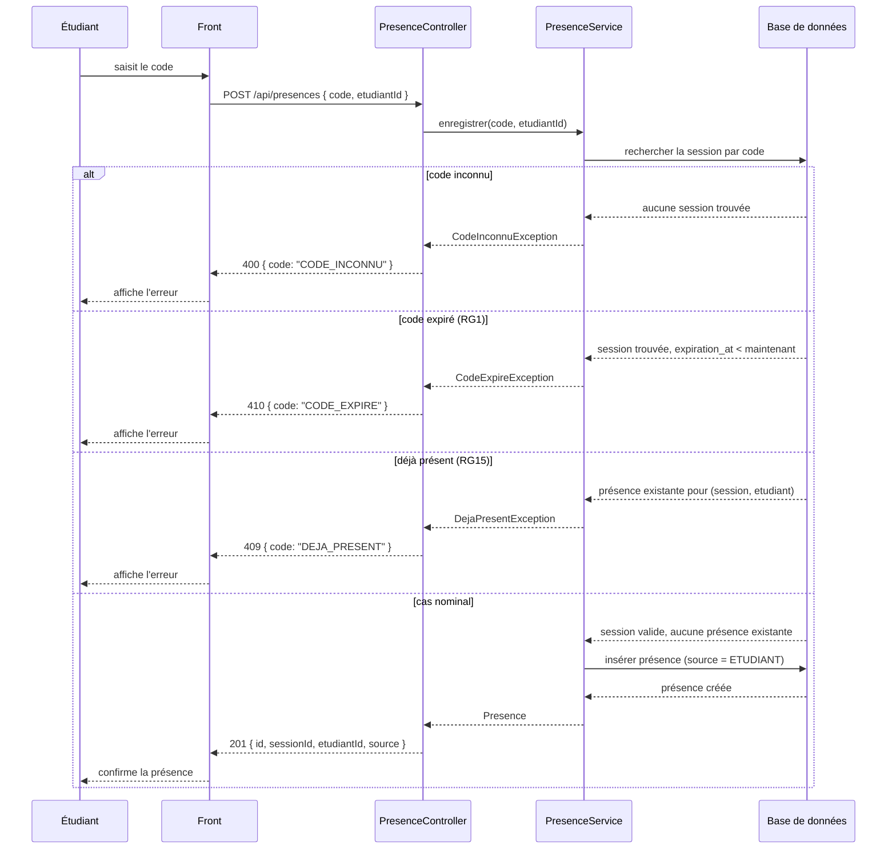
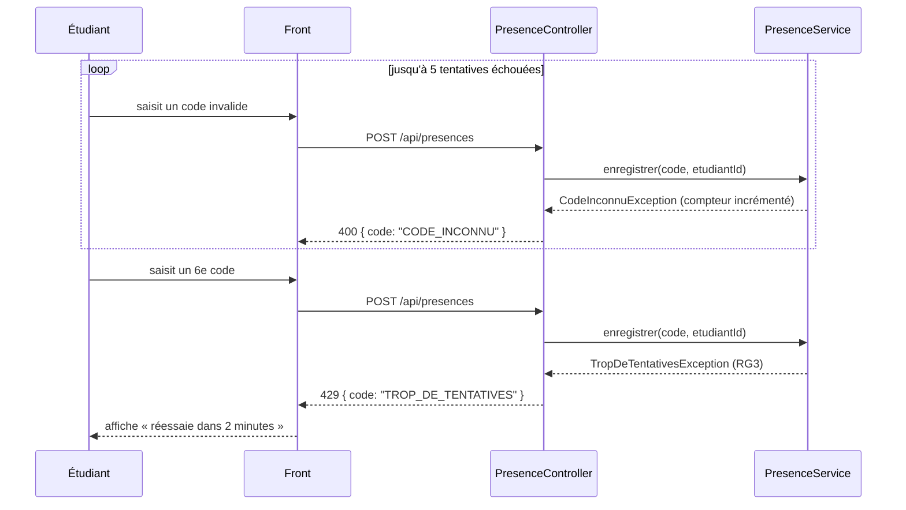

# D3 — Séquence : marquer sa présence

Cas nominal et trois cas d'erreur, alignés avec les codes HTTP de `POST /api/presences`
dans `api/contrat.yaml` (400, 409, 410). Le cas des 5 tentatives erronées (RG3) est
représenté séparément car il s'accumule sur plusieurs appels.

## Cas complémentaire — blocage après 5 erreurs (RG3)

