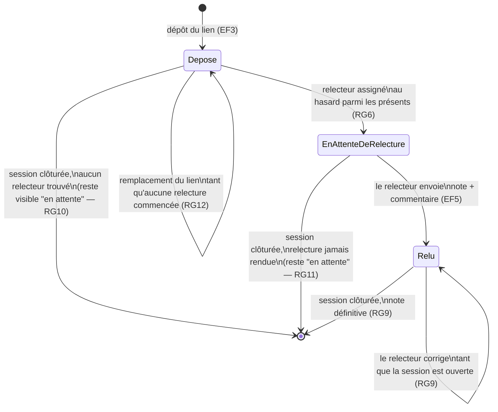

# D4 — États-transitions du cycle de vie d'un exercice (bonus)

> À la clôture de la session (RG14), toute transition sortante de `Relu` est
> bloquée : la note devient définitive. Un exercice resté en `EnAttenteDeRelecture`
> à la clôture reste affiché comme « en attente » dans le tableau du formateur (Q11).
