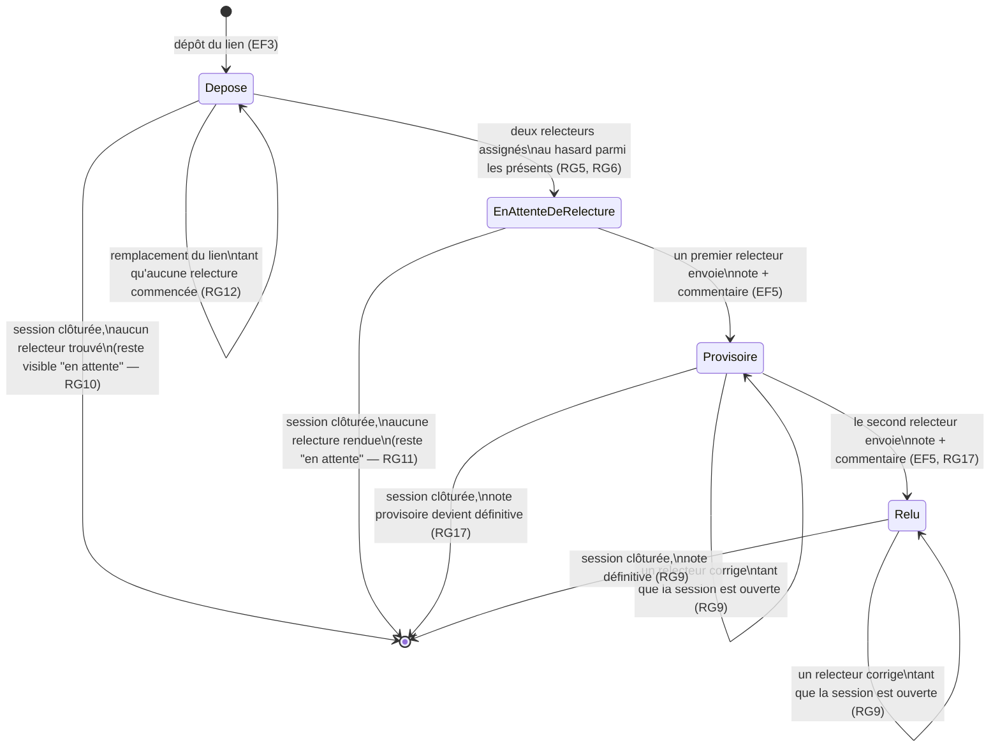

# D4 — États-transitions du cycle de vie d'un exercice (bonus)

> **Mis à jour à l'étape 3** : ajout de l'état `Provisoire` entre l'attente et le
> relu, conséquence du passage à deux relecteurs distincts (RG5, RG17).

> À la clôture de la session (RG14), toute transition sortante de `Provisoire` ou
> `Relu` est bloquée : la note (moyenne des relectures rendues, RG17) devient
> définitive telle quelle. Un exercice resté en `EnAttenteDeRelecture` à la clôture
> reste affiché comme « en attente » dans le tableau du formateur (Q11).
